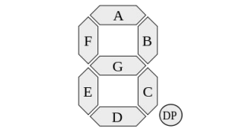
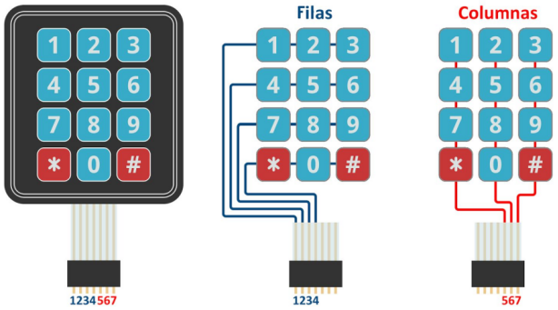

# Periféricos externos y virtuales de la biblioteca sAPI

Estos modelan periféricos conectados al la placa a utilizar, como por ejemplo,
un chip conectado al I2C o al SPI. También incluyen periféricos "virtuales",
como un I2C por software que para funcionar utiliza GPIOs.
La característica distintiva de este tipo de módulos es que se deben asignar
estructuras específicas porque no existen hasta que se "crean" e "inicializan"
(análogo al new de C++).

## Display 7 segmentos

Utiliza varios **GPIOs**.

**Configuración**

Configurar los pines conectados al display 7 segmentos como salida:

``void display7SegmentPinConfig( gpioMap_t* display7SegmentPins );``

- Parámetro: ``gpioMap_t* display7SegmentPins`` puntero a un vector con los 8 pines conectados al display 7 segmentos, deben estar en el orden *a* a *h*.
- Retorna: nada.

Ejemplo:

``uint8_t display7Segment[8] = {
    GPIO5, // Segment 'a'
    GPIO7, // Segment 'b'
    GPIO6, // Segment 'c'
    GPIO1, // Segment 'd'
    GPIO2, // Segment 'e'
    GPIO4, // Segment 'f'
    GPIO3, // Segment 'g'
    GPIO8  // Segment 'h' or 'dp'
 };``

Testear en que orden están conectados los pines a los segmentos *a* a *h*:

``void display7SegmentTestPins( gpioMap_t* display7SegmentPins, gpioMap_t pin );``

- Parámetro: ``gpioMap_t* display7SegmentPins`` puntero a un vector con los 8 pines conectados al display 7 segmentos, deben estar en el orden *a* a *h*.
- Parámetro: ``gpioMap_t pin`` un pin aparte que indica cuando escribe el segmento *a* para iniciar la secuencia de la *a* a *h*. Por ejemplo, LEDB.
- Retorna: nada.

Mediante esta función se puede completar la siguiente tabla que indica a qué pines se conecto el display 7 segmentos:

| Segmento encendido     | Valor Binario | Valor Hexadecimal | Pin de salida |
|:----------------------:|:-------------:|:-----------------:|:-------------:|
| Segmento 'a' encendido | 0b00000001    |   0x20            | (a completar) |
| Segmento 'b' encendido | 0b00000010    |   0x80            |               |
| Segmento 'c' encendido | 0b00000100    |   0x40            |               |
| Segmento 'd' encendido | 0b00001000    |   0x02            |               |
| Segmento 'e' encendido | 0b00010000    |   0x04            |               |
| Segmento 'f' encendido | 0b00100000    |   0x10            |               |
| Segmento 'g' encendido | 0b01000000    |   0x08            |               |
| Segmento 'h' encendido | 0b10000000    |   0x80            |               |

**Escribir símbolo en display 7 segmentos**

Escribe un símbolo en el display 7 segmentos.

``void display7SegmentWrite( gpioMap_t* display7SegmentPins, uint8_t symbolIndex );``

- Parámetro: ``gpioMap_t* display7SegmentPins`` puntero a un vector con los 8 pines conectados al display 7 segmentos, deben estar en el orden *a* a *h*.
- Parámetro: ``uint8_t symbolIndex`` índice del valor a mostrar de la tabla de símbolos.
- Retorna: nada.

Tabla de símbolos:

``0, 1, 2, 3, 4, 5, 6, 7, 8, 9, 
 a, b, c, d, e, f,
 A, C, E, H, J, L, P, U
 ., DISPLAY_OFF``

## Teclado matricial

Utiliza varios **GPIOs**.

**Configuración**

``bool_t keypadConfig( keypad_t* keypad,
                      gpioMap_t* keypadRowPins, uint8_t keypadRowSize,
                      gpioMap_t* keypadColPins, uint8_t keypadColSize );``

- Parámetro: ``keypad_t* keypad`` puntero a estructura del teclado matricial donde se almacenan todos los parámetros necesarios del mismo.
- Parámetro: ``gpioMap_t* keypadRowPins`` puntero a vector que contiene la lista de pines conectados a las filas del teclado matricial.
- Parámetro: ``uint8_t keypadRowSize`` cantidad de filas del teclado matricial.
- Parámetro: ``gpioMap_t* keypadColPins`` puntero a vector que contiene la lista de pines conectados a las columnas del teclado matricial.
- Parámetro: ``uint8_t keypadColSize`` cantidad de columnas del teclado matricial.
- Retorna: ``bool_t`` TRUE si los parámetros de configuración son válidos.

Ejemplo:

- Variable del teclado

      ``keypad_t keypad;``

- Filas a configuar como Salidas

      ``uint8_t keypadRowPins1[4] = {
          RS232_TXD, // Row 0
          CAN_RD,    // Row 1
          CAN_TD,    // Row 2
          T_COL1     // Row 3
       };``

- Columnas a configurar como Entradas con pull-up (MODO = GPIO_INPUT_PULLUP)

      ``uint8_t keypadColPins1[4] = {
          T_FIL0,   // Column 0
          T_FIL3,    // Column 1
          T_FIL2,    // Column 2
          T_COL0     // Column 3
       };``

- Función de configuración

      ``keypadConfig( &keypad, keypadRowPins1, 4, keypadColPins1, 4 );``

**Lectura de teclado matricial**

``bool_t keypadRead( keypad_t* keypad, uint16_t* key );``

- Parámetro: ``keypad_t* keypad`` puntero a estructura del teclado matricial.
- Parámetro: ``uint16_t* key`` puntero a variable donde escribe la tecla leida del teclado matricial.
- Retorna: ``bool_t`` TRUE si hay tecla leida o FALSE en caso contrario.

## Servo

Manejo de salidas para Servomortores angulares (usan modulación por ancho de pulso). En la EDU-CIAA-NXP se utilizan internamente los periféricos TIMER para
generar estas salidas.

Utiliza un **Timer**.

**Configuración**

``bool_t servoConfig( servoMap_t servoNumber, servoConfig_t config );``

- Parámetro: ``servoMap_t servoNumber`` pin a configurar como salida Servo (ver Servo Map).
- Parámetro: ``servoConfig_t config`` configuración.
- Retorna: ``bool_t`` TRUE si la configuración es correcta.

Posibles configuraciones:

- ``SERVO_ENABLE`` habilita el o los Timers en modo PWM para Servo.
- ``SERVO_DISABLE`` deshabilita el o los Timers en modo PWM para Servo.
- ``SERVO_ENABLE_OUTPUT`` habilita la salida PWM particular.
- ``SERVO_DISABLE_OUTPUT`` deshabilita la salida PWM particular.

**Lectura del valor angular actual de la salida Servo**

``uint16_t servoRead( servoMap_t servoNumber);``

- Parámetro: ``servoMap_t servoNumber`` pin como salida Servo a leer.
- Retorna: ``uint16_t`` el valor angular actual de la salida Servo (de 0 a 180°).

**Establecer el valor angular de la salida Servo**

``bool_t servoWrite( servoMap_t servoNumber, uint16_t angle );``

- Parámetro: ``servoMap_t servoNumber`` pin como salida Servo a escribir.
- Parámetro: ``uint16_t angle`` valor angular a establecer en la salida Servo (de 0 a 180°).
- Retorna: ``bool_t`` TRUE.

## HMC5883L

Utiliza un **I2C**.

Manejo del sensor magnetómetro vectorial (x,y,z) HMC5883L de Honeywell.
Este sensor se conecta mediante I2C.

**Configuración**

``bool_t hmc5883lPrepareDefaultConfig( HMC5883L_config_t* config );``

- Parámetro: ``HMC5883L_config_t *config`` puntero a estructura del tipo HMC5883L_config_t a donde se cargarán los valores por defecto de configuración.
- Retorna: ``bool_t`` TRUE.

``bool_t hmc5883lConfig( HMC5883L_config_t config );``

- Parámetro: ``HMC5883L_config_t *config`` estructura del tipo HMC5883L_config_t desde donde se cargarán los valores de configuración.
- Retorna: ``bool_t`` TRUE si la configuración es correcta.

La estructura del tipo ``HMC5883L_config_t`` contiene:

- ``HMC5883L_samples_t samples`` Numero de muestras que promedia para calcular la salida de la medición. Valores admitidos:
    - HMC5883L_1_sample
    - HMC5883L_2_sample
    - HMC5883L_4_sample
    - HMC5883L_8_sample
    - HMC5883L_DEFAULT_sample = HMC5883L_1_sample
- ``HMC5883L_rate_t rate`` Bits de tasa de datos de salida. Estos bits establecen la tasa de escritura de los 3 registros de datos de salida del sensor. Valores admitidos:
    - HMC5883L_0_75_Hz
    - HMC5883L_1_50_Hz
    - HMC5883L_3_Hz
    - HMC5883L_7_50_Hz
    - HMC5883L_15_Hz
    - HMC5883L_30_Hz
    - HMC5883L_75_Hz
    - HMC5883L_DEFAULT_rate = HMC5883L_15_Hz
- ``HMC5883L_messurement_t meassurement`` Bits de configuración de medición. Estos bits definen el flujo de medición del sensor. Específicamente si se aplica, o no, un bias a la medición. Valores admitidos:
    - HMC5883L_normal
    - HMC5883L_positive
    - HMC5883L_regative
    - HMC5883L_DEFAULT_messurement = HMC5883L_normal
- ``HMC5883L_gain_t gain`` Bits de configuración de ganancia. Estos bits configuran la ganancia del sensor. Esta configuración se aplica a todos los canales. Valores admitidos:
    - HMC5883L_1370 para ± 0.88 Ga
    - HMC5883L_1090 para ± 1.3 Ga
    - HMC5883L_820 para ± 1.9 Ga
    - HMC5883L_660 para ± 2.5 Ga
    - HMC5883L_440 para ± 4.0 Ga
    - HMC5883L_390 para ± 4.7 Ga
    - HMC5883L_330 para ± 5.6 Ga
    - HMC5883L_230 para ± 8.1 Ga
    - HMC5883L_DEFAULT_gain = HMC5883L_1090
- ``HMC5883L_mode_t mode``. Modo de medición. Valores admitidos:
    - HMC5883L_continuous_measurement
    - HMC5883L_single_measurement
    - HMC5883L_idle
    - HMC5883L_DEFAULT_mode = HMC5883L_single_measurement

**Prueba de lectura del magnetómetro**

``bool_t hmc5883lIsAlive( void );``

- Parámetro: ``void`` ninguno.
- Retorna: ``bool_t`` TRUE si puede comunicarse con el sensor.

**Lectura del valor del magnetómetro en (x,y,z)**

``bool_t hmc5883lRead( int16_t* x, int16_t* y, int16_t* z );``

- Parámetro: ``int16_t * x`` puntero entero de 16 bits con signo donde se guardará el valor leído del sensor HMC5883L en la componente x.
- Parámetro: ``int16_t * y`` puntero entero de 16 bits con signo donde se guardará el valor leído del sensor HMC5883L en la componente y.
- Parámetro: ``int16_t * z`` puntero entero de 16 bits con signo donde se guardará el valor leído del sensor HMC5883L en la componente z.
- Retorna: ``bool_t`` TRUE si puede leer correctamente el sensor magnetómetro.

## Archivos que contienen estos módulos

**src** (.c):

- sapi_7_segment_display.c
- sapi_hmc5883l.c
- sapi_keypad.c
- sapi_servo.c

**inc** (.h):

- sapi_7_segment_display.h
- sapi_hmc5883l.h
- sapi_keypad.h
- sapi_servo.h
